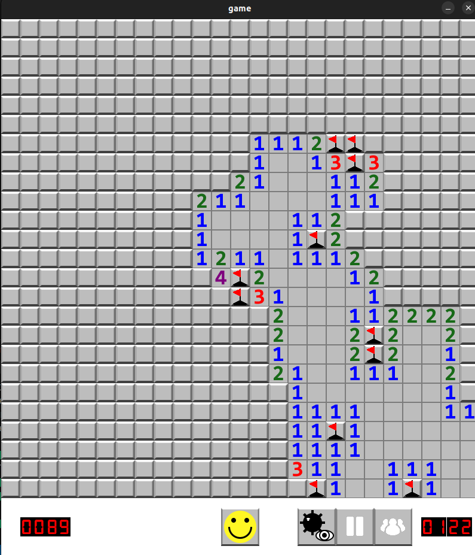

# Minesweeper - Fall 2023 Project

UPDATED for a event loop + websocket server to be ran as a docker container!!!

See break my mindsweeper for a example implemnetaion of this! Includes a event loop with task management, saving of queues nad data nd more here througout the applcaiton :33333 ARGGGG RAAAAA JFEEJIOFEJFOEJ KILLLLL MEEEE

##### **Name**: Matthew Boughton

##### **System**: Ubuntu 22.04.2 LTS

##### **Compiler**: 11.4.0

##### **SFML Version**: 2.5.1+dfsg-2

##### **IDE**: VSCode

---



## **Usage**

Follow the steps below to install the necessary tools, build the project, and run the game.
If you are currently taking UF's COP 3503, **DO NOT** view this codebase. You will be flagged for cheating and removed from the class immediately.

---

### **1. Install Required Tools**

#### **Install a C++ Compiler**

You need a C++ compiler that supports C++17. On Ubuntu, you can install `g++` by running:

```bash
sudo apt update
sudo apt install g++
```

#### **Install SFML**

The game uses the Simple and Fast Multimedia Library (SFML) for graphics and input handling. On Ubuntu, install SFML and `pkg-config` using:

```bash
sudo apt-get install libsfml-dev pkg-config
```

On macOS, the client uses the SFML 2 API. Install the compatible keg-only
formula and `pkgconf` using:

```bash
brew install sfml@2 pkgconf
```

The Makefile discovers either installation through `pkg-config`; no global
Homebrew symlink is required.

### **2. Build Project**

In the project directory, use the Makefile to compile the code:

```bash
make build
```

The project is organized by software responsibility:

```text
src/game.*              deterministic rules and state
src/runtime.*           commands, authoritative games, and public snapshots
src/protocol.*          binary protocol v2 mapping
src/binary_codec.hpp    private byte encoding primitives
src/game_state_file.*   JSON checkpoint persistence
src/tcp_server.*        TCP framing and connection lifecycle
src/leaderboard.*       leaderboard persistence
src/app/                desktop and server entry points
src/ui/                 SFML-only windows and rendering
tests/                  focused game, runtime, protocol, and persistence tests
assets/                 fonts and images
config/                 checked-in desktop defaults
data/                   ignored mutable local state
```

Headers stay beside their implementations under `src/` because this project
does not publish a C++ library. The published integration boundary is the
TypeScript SDK under `clients/typescript`.

The planned append/replay persistence exercise is documented in
[`docs/game-journal.md`](docs/game-journal.md).

Build the graphical client or headless runtime separately:

```bash
make client
make server
make test
```

### **3. Run the Game**

After building, if you would like to, edit the config file.
Edit `config/board.cfg` to change each line associated with rows, columns,
and mine count respectively.

Finally, run with

```bash
./build/minesweeper-desktop
```

The headless runtime exposes a small development CLI when
`MINESWEEPER_MODE=cli`:

```bash
./build/minesweeper-server
```

It accepts `reveal ROW COL`, `flag ROW COL`, `restart`, and `quit`. In server
mode, `TcpServer` decodes framed commands and delegates them to `GameRuntime`;
networking never receives direct access to the game map.

### Container and persistent data

Build and run the headless runtime with a persistent data volume:

```bash
docker build \
  --build-arg VERSION=0.2.0 \
  -t mattcattb/minesweeper:0.2.0 \
  -t mattcattb/minesweeper:latest \
  .
docker run --rm -v minesweeper-data:/data mattcattb/minesweeper:latest
```

Publish the same version for AMD64 and ARM64:

```bash
docker buildx build \
  --platform linux/amd64,linux/arm64 \
  --build-arg VERSION=0.2.0 \
  -t mattcattb/minesweeper:0.2.0 \
  -t mattcattb/minesweeper:latest \
  --push .
```

The runtime reads these environment variables:

```text
MINESWEEPER_MODE=server
MINESWEEPER_PORT=7575
MINESWEEPER_DATA_DIR=/data
MINESWEEPER_LEADERBOARD_PATH=/data/leaderboard.csv
```

`MINESWEEPER_LEADERBOARD_PATH` overrides the file location directly. When it is
unset, the runtime writes `leaderboard.csv` below `MINESWEEPER_DATA_DIR`. The
directory is created on startup, and startup fails when the configured path is
not writable.

Server mode listens on `MINESWEEPER_PORT` using protocol version 2. Each frame
starts with a four-byte unsigned big-endian payload length, and both request and
response payloads use the binary representation in
[`docs/protocol-v2.md`](docs/protocol-v2.md). Socket I/O, partial frame
buffering, command dispatch, and event serialization run in one `poll()` loop;
game behavior stays inside the headless `GameRuntime`.

The server-side TypeScript client lives in `clients/typescript`. It can be
developed as a Bun workspace dependency from the Break My System repository or
built and published independently:

```bash
cd clients/typescript
bun install
bun test
bun run build
```
